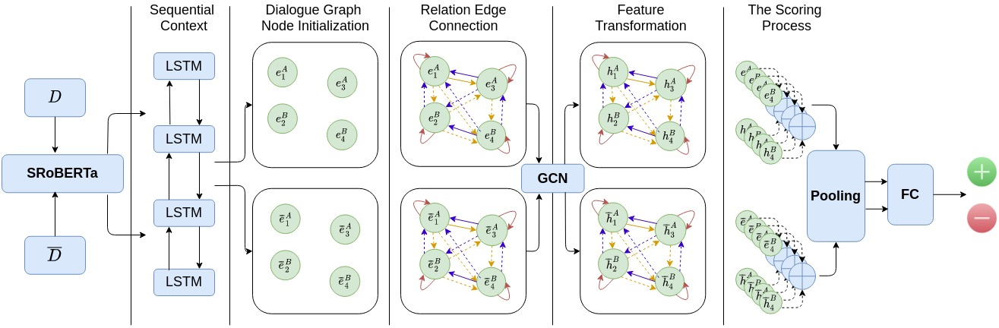

# DynaEval


## Installation

```bash
conda env create -f environment.yml
conda activate gcn
```
## Resources
processed datasets can be found at https://drive.google.com/file/d/195qPhTWMxsgIZMW29IZ_QGHekqzggfB4/view?usp=sharing

checkpoints can be found at https://drive.google.com/file/d/1K8-o6BhJawAOxgTJ_0DK0Etya_UnmPbq/view?usp=sharing

Finetuned RoBERTa model can be found at https://drive.google.com/file/d/1jQ3MqJ1GVE1LXpqZeTmJFMVuYlLOurqe/view?usp=sharing

## Example commands

### Preprocess training data
The following command will preprocess data for `empathetic` corpus for `us` task.

```bash
export dataset=empathetic
export dataset_dir=data/${dataset}
export task=us

python -u preprocess.py \
        --data_path=${dataset_dir} \
        --dataset=${dataset} --perturb_type ${task}

```

### Train DynaEval model
The following command will train a model on `empathetic` corpus for `us` task.

```bash
export dataset=empathetic
export dataset_dir=data/${dataset}
export task=us

python -u train.py \ 
        --data=${dataset_dir}/${dataset}_${task}.pkl \
        --from_begin \
        --device=cuda \
        --model_name_or_path roberta-base-nli-stsb-mean-tokens \
        --model_save_path output/${dataset}-${task}-roberta-base-nli-mean
```

### Evaluate DynaEval model
The following command will evaluate a trained model on `empathetic` corpus for `us` task.

```bash
export dataset=empathetic
export dataset_dir=data/${dataset}
export task=us
export model_path=your_model_path
export checkpoint_name=your_checkpoint_name

python -u eval.py \
        --data=${dataset_dir}/${dataset}_${task}.pkl \
        --device=cuda \
        --model_name_or_path roberta-base-nli-stsb-mean-tokens \
        --model_save_path ${model_path} \
        --oot_model ${checkpoint_name}
```

### Score 
The following command provides metric scores based on a trained model

#### Preprocess evaluation data
The following command will preprocess evaluation data for dialogue evaluation task.

```bash
export dataset=feddial
export dataset_dir=data/${dataset}

python -u create_eval_data.py \
        --data_path=${dataset_dir} \
        --dataset=${dataset}

```

#### Generate score file

```bash
export model_save_path=your_model_save_path
export checkpoint_name=your_checkpoint_name
export dataset=feddial
export dataset_dir=data/${dataset}

python -u score.py \
        --data=${dataset_dir}/${dataset}_eval.pkl \
        --device=cuda \
        --model_name_or_path roberta-base-nli-stsb-mean-tokens \
        --loss_type=coh \
        --model_save_path ${model_save_path} \
        --oot_model ${checkpoint_name}

```

#### Compute correlation
```bash
export dataset=feddial
export dataset_dir=data/${dataset}

cd ${dataset_dir}

python -u compute_corr.py

```
## Acknowledge

The implementation of this repository is based on https://github.com/declare-lab/conv-emotion

The data creation process is based on https://github.com/UKPLab/acl2020-dialogue-coherence-assessment

